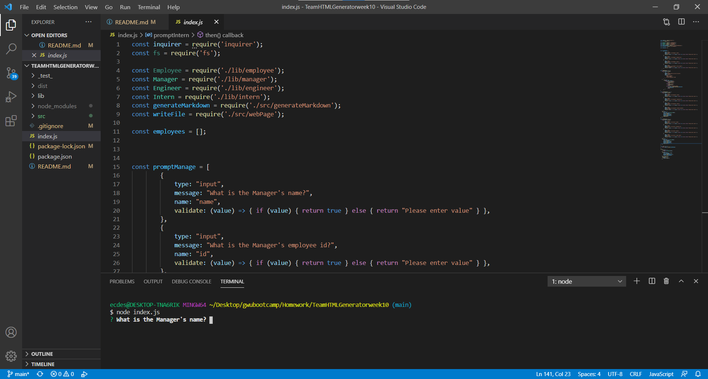
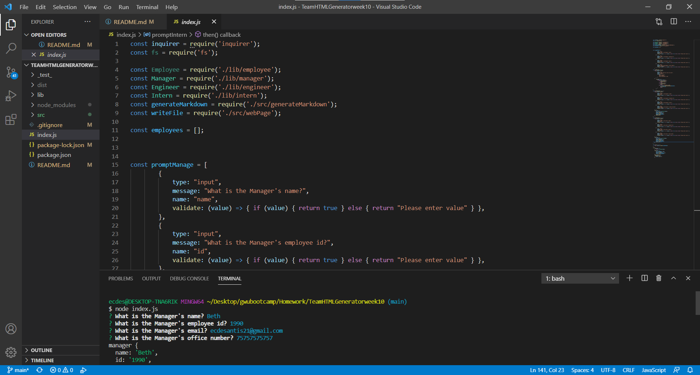
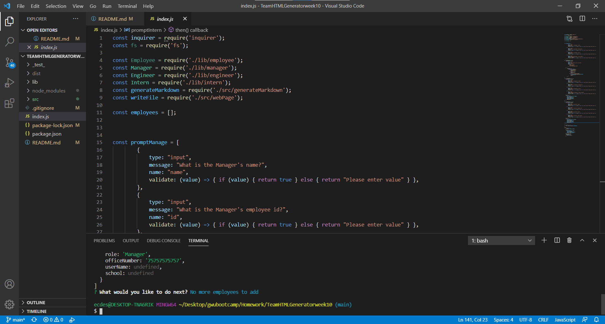
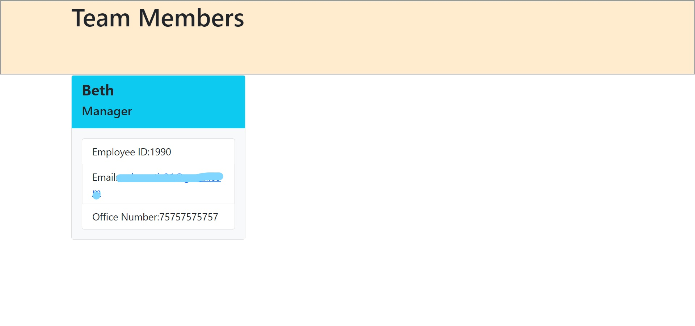
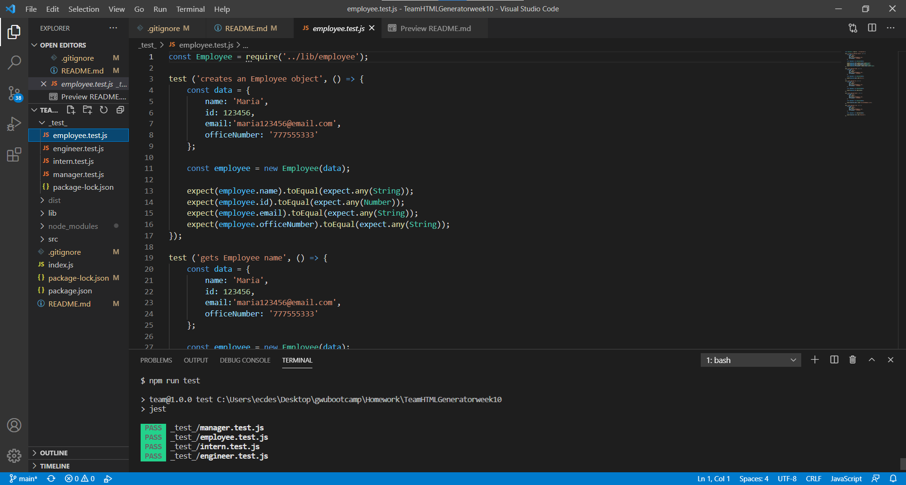

# Team Member Generator

----

## Table of Contents

*[Description](#description)

*[Installation](#installation)

*[Usage](#usage)

*[How to test](#test)

*[Contact Me](#Contact-Information)
  
## Description
When prompted questions are answered, the member of a team are rendered on a HTML page
  
## Installation
Must have node.js to use!  After node.js is installed, fork from desantel repo on github.  Open the file in VSC.  Open an integrated terminal.  Type in npm i and allow to install.  
  
## Usage
In the same terminal, type in node index.js and answer prompted questions.

  
## How to Test
Go into the _test_ folder in your terminal and type in npm run test.  This will run tests with in the terminal

  
## Contact-Information
[Github Profile](https://github.com/desantel)

elizabeth.desantis90@gmail.com
